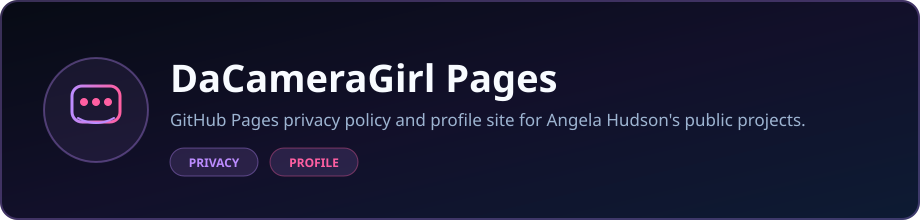

  

  <strong>GitHub Pages privacy policy and profile site for Angela Hudson's public projects.</strong>

  
  

  
  

### Languages

  

### Stack

  
  

  Built by <strong>Angela Hudson</strong> · <a href="https://github.com/DaCameraGirl">DaCameraGirl</a>

# dacameragirl.github.io

Angela Hudson's GitHub Pages user site — privacy policy host and landing page.

**Live:** [dacameragirl.github.io](https://dacameragirl.github.io/)

| URL | Purpose |
|-----|---------|
| `/` | Angela Hudson landing + policy index |
| `/privacy-policy/` | ENV_OPEN_CLAW WHOOP integration policy |

Privacy questions: [angela.hudson.data@gmail.com](mailto:angela.hudson.data@gmail.com)